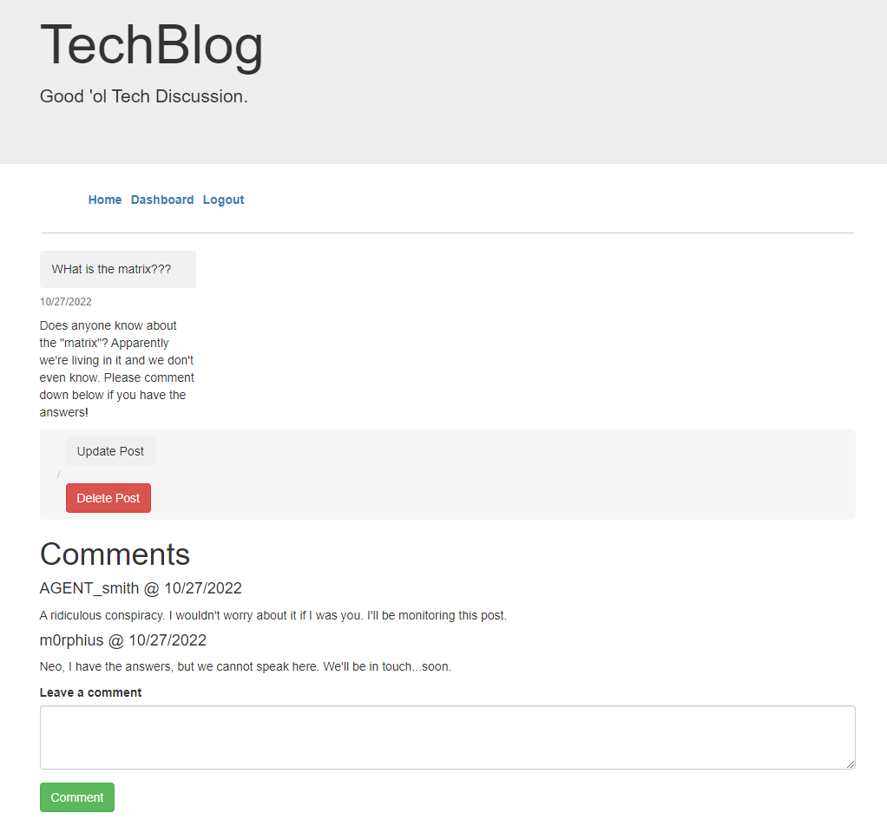

# Tech Blog

## Deployed Application

[Link to deployed application](https://tech-blog-kj2022.herokuapp.com/)

## Description
CMS-style blog for discussing technology, built using Express/Sequelize and deployed with Heroku.
Here is a screenshot of the finished application:

## Table of Contents
- [Installation](#installation)
- [Usage](#usage)
- [Credits](#credits)

## Installation
N/A

## Usage
Discussing technology through creating posts and commenting on other posts.

## Contributing
N/A

## Tests
N/A

## Questions
If you have any questions related to this project, contact through my [GitHub](https://github.com/kieferjackson) or contact at the following email address: [kieferleejackson@gmail.com](kieferleejackson@gmail.com)

## Credits
This project was developed by [kieferjackson](https://github.com/kieferjackson)
